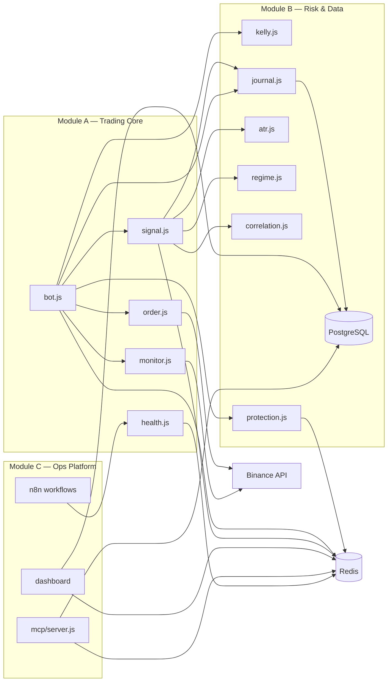

# Architecture — 3 modules de développement
## BotTrader v1.0 — ROHAN Innovation / OCO_strategie

**Version :** 1.0  
**Date :** 10 juillet 2026  
**Statut :** Document de référence développement  
**Complète :** `CAHIER_DEVELOPPEMENT.md`, `RAPPORT_ALIGNEMENT_CDC_CD.md`

> Ce document décrit la division **fonctionnelle** du programme en 3 sous-programmes
> à développer, tester et livrer séparément. Il ne s'agit **pas** d'une division par
> coin (BTC/SOL/ETH) — les 3 paires partagent le même code via des fichiers `.env`.

---

## Table des matières

1. Vue d'ensemble
2. Module A — Trading Core
3. Module B — Risk & Data
4. Module C — Ops Platform
5. Ordre de développement
6. Interfaces entre modules
7. Répartition effort
8. Relation avec les 3 paires (BTC/SOL/ETH)

---

## 1. Vue d'ensemble

```
┌─────────────────────────────────────────────────────────────┐
│                    BOTTRADER v1.0                           │
├─────────────────┬─────────────────────┬─────────────────────┤
│  MODULE A       │  MODULE B           │  MODULE C           │
│  Trading Core   │  Risk & Data        │  Ops Platform       │
│  (moteur)       │  (cerveau + mémoire)│  (pilotage)         │
├─────────────────┼─────────────────────┼─────────────────────┤
│  bot.js         │  protection.js      │  dashboard/         │
│  signal.js      │  journal.js         │  mcp/server.js      │
│  order.js       │  atr.js             │  n8n/workflows/     │
│  monitor.js     │  regime.js          │  backtest engine    │
│  health.js      │  correlation.js     │                     │
│                 │  kelly.js           │                     │
│                 │  db/schema.sql      │                     │
└─────────────────┴─────────────────────┴─────────────────────┘
         │                   │                     │
         └───────────────────┴─────────────────────┘
                    Redis + PostgreSQL
```

### Analogie

| Module | Métaphore | Question clé |
|--------|-----------|--------------|
| **A — Trading Core** | Le pilote | « J'achète ou pas ? À quel prix ? » |
| **B — Risk & Data** | Le copilote + boîte noire | « C'est risqué ? Combien ? Qu'a-t-on fait ? » |
| **C — Ops Platform** | La tour de contrôle | « Comment voir, piloter et automatiser ? » |

---

## 2. Module A — Trading Core (moteur d'exécution)

### Rôle

Lire le marché en temps réel, décider d'entrer en position, passer les ordres Binance
(OPOCO), surveiller les fills et gérer le cycle de vie d'un trade.

### Fichiers

| Fichier | Responsabilité | Export principal |
|---------|----------------|------------------|
| `bot.js` | Boucle principale, machine d'état, orchestration | `run()` |
| `signal.js` | 12 filtres — faut-il trader ? | `evaluateSignal()` |
| `order.js` | OPOCO, LIMIT_MAKER, slippage, waitForFill | `placeEntry()`, `placeOPOCO()` |
| `monitor.js` | WebSocket Binance, executionReport | `startMonitor()`, `waitForResult()` |
| `health.js` | API HTTP /health, /stop, /restart, /config | `startHealthServer()` |

### Machine d'état (`bot.js`)

```
IDLE → SCANNING → WAITING_FILL → POSITION_OPEN → IDLE
                      ↓ timeout          ↓ TP ou SL
                   SCANNING ←─────────────┘
        STOPPED (perte max ou erreur critique)
```

### Dépendances

- **Consomme Module B :** kelly, journal, atr, regime, correlation, protection
- **Infra requise :** Redis, PostgreSQL, connexion Binance API

### Livrable

Bot autonome capable de tourner en `DRY_RUN=true` : signaux détectés, ordres simulés,
health check répondant sur `/health`.

### Tests critiques

| Fichier | Couverture min | Tests clés |
|---------|----------------|------------|
| `order.js` | 90% | OPOCO sans pendingQuantity, TP LIMIT GTC, slippage, DRY_RUN |
| `monitor.js` | 80% | waitForResult, waitForFill, routing executionReport |
| `signal.js` | 95% | Chaque filtre individuellement |
| `bot.js` | 80% | SIGTERM handler, await computeKellyAuto |

---

## 3. Module B — Risk & Data (cerveau + mémoire)

### Rôle

Analyser le contexte marché, calculer le sizing, appliquer les règles de protection
capital, persister chaque trade et événement en base.

### Fichiers

| Fichier | Responsabilité | Export principal |
|---------|----------------|------------------|
| `kelly.js` | Taille de position (formule Kelly) | `computeKellyFormula()`, `computeKellyAuto()` |
| `atr.js` | Volatilité → TP/SL adaptatifs | `getATR()` |
| `regime.js` | Détection TREND_UP/DOWN/VOLATILE/RANGE | `getRegime()`, `checkTrendDown()` |
| `correlation.js` | Blocage si paires trop corrélées | `shouldBlockOnCorrelation()` |
| `protection.js` | Stop pertes, locks Redis, stop global | `checkAndLock()`, `checkPositionTimeout()` |
| `journal.js` | Écriture PostgreSQL, PnL jour | `logTradeOpen()`, `logTradeClose()`, `getDayPnl()` |
| `db/schema.sql` | Schéma tables trades, events, daily_summary | — |

### Schéma base (4 tables)

```
trades          → chaque trade (entrée, sortie, PnL, régime, kelly…)
events          → événements système (SIGNAL_REJECTED, STOP, SLIPPAGE_ABORT…)
daily_summary   → agrégats quotidiens par paire
mcp_actions     → audit actions MCP
```

### Dépendances

- **Autonome** : testable sans Module A ni Binance
- **Infra requise :** Redis, PostgreSQL

### Livrable

Couche entièrement testable en Jest sans appel API externe. Schéma SQL déployé et validé.

### Tests critiques

| Fichier | Couverture min | Tests clés |
|---------|----------------|------------|
| `kelly.js` | 95% | Formule, clamp min/max, async < 100 trades |
| `atr.js` | 90% | Calcul correct, cache Redis |
| `regime.js` | 85% | Chaque régime, TREND_DOWN 48h/96h |
| `correlation.js` | 85% | Pearson sur données fixes, blocage |
| `protection.js` | 90% | Lock après 3 SL, stop global |
| `journal.js` | 80% | INSERT/UPDATE, compteur 1500 trades |

---

## 4. Module C — Ops Platform (pilotage externe)

### Rôle

Fournir les interfaces de pilotage, monitoring, alertes et automatisation autour du bot.
Ne participe pas directement au trading.

### Composants

| Composant | Responsabilité | Port |
|-----------|----------------|------|
| `dashboard/` | Interface web 9 onglets | 3010 |
| `mcp/server.js` | 10 outils MCP pour Claude Desktop | 5010 |
| `n8n/workflows/` | 6 workflows automatisation | via N8n UltiumGrid |
| Backtest engine | Simulation historique (API dashboard) | 3010/api |

### Dashboard — 9 onglets

| Onglet | Contenu |
|--------|---------|
| Dashboard | Stats globales, PnL intraday, Profit Factor |
| Graphiques | PnL 30j, WR, distribution, drawdown |
| Historique | Table trades + filtres + export CSV |
| Analyse | Perf par paire, WR par régime, Sortino |
| Backtest | 12 paramètres, Sharpe annualisé |
| Fronttest | 3 scénarios paper trading |
| Configuration | Paramètres + toggle DRY_RUN |
| Commandes | Start/stop/restart, terminal |
| Logs | 4 panneaux (btc, sol, eth, n8n) |

### MCP — 10 outils

| Outil | Type | Description |
|-------|------|-------------|
| `get_pnl` | Lecture | PnL live et historique |
| `get_trades` | Lecture | Historique filtrable |
| `get_status` | Lecture | État bot, DRY_RUN |
| `get_regime` | Lecture | Régime + ATR + corrélation |
| `analyze_perf` | Analyse | Profit Factor + Sharpe |
| `set_config` | Action | TP/SL à chaud via Redis |
| `stop_bot` | Action | Arrêt propre |
| `start_bot` | Action | Démarrage |
| `cancel_orders` | Action | Annulation ordres ouverts |
| `run_query` | Analyse | SELECT uniquement (sécurisé) |

### Workflows N8n (6)

| WF | Déclencheur | Action |
|----|-------------|--------|
| WF1 Health Check | Cron /5min | Ping /health → POST /restart si KO |
| WF2 Trade Alert | Webhook /trade | Telegram + Profit Factor |
| WF3 Stop Global | Webhook /stop-global | POST /stop 3 bots |
| WF4 Rapport Daily | Cron 23h58 UTC | Agrégats + Telegram |
| WF5 Reset Daily | Cron 00h01 UTC | POST /config reset_daily |
| WF6 Config Update | Webhook /config | Redis pub/sub |

### Dépendances

- **Consomme Module A :** appels HTTP `/health`, `/stop`, `/restart`, `/config`
- **Consomme Module B :** lecture PostgreSQL, Redis pub/sub
- **Externe :** N8n UltiumGrid (`ultiumgrid_obs-n8n-1`, port 25678)

### Livrable

Dashboard accessible, MCP opérationnel, 6 workflows N8n importables et fonctionnels.

---

## 5. Ordre de développement (séquence stricte)

```
MODULE B — Risk & Data (développer EN PREMIER)
│
│  B.1  db/schema.sql
│  B.2  src/kelly.js
│  B.3  src/journal.js
│  B.4  src/atr.js
│  B.5  src/regime.js
│  B.6  src/correlation.js
│  B.7  src/protection.js
│  ✅ Tests Jest Module B → 100% avant de continuer
│
▼
MODULE A — Trading Core
│
│  A.1  src/health.js
│  A.2  src/order.js + src/monitor.js
│  A.3  src/signal.js
│  A.4  src/bot.js
│  ✅ DRY_RUN fonctionnel → 100% avant de continuer
│
▼
MODULE C — Ops Platform
│
│  C.1  n8n/workflows/ (6 JSON)
│  C.2  dashboard/ (9 onglets)
│  C.3  mcp/server.js
│  C.4  backtest engine
│  ✅ Stack complète opérationnelle
│
▼
VALIDATION (hors modules code)
    DRY_RUN 1 sem → Testnet 2 sem → Prod 10% → Prod complète
```

> **Règle absolue :** ne jamais passer au module suivant si les tests du module
> courant ne passent pas à 100 %.

### Correspondance avec le Cahier de développement

| Module doc | Phase CD | Sections CD |
|------------|----------|-------------|
| Module B | Phase 1 (partie données) | §4.1–4.8, §4.3 kelly |
| Module A | Phase 1 (partie exécution) | §4.9–4.13 |
| Module C | Phase 3 | §6 |
| Validation | Phase 4 | §7 |

---

## 6. Interfaces entre modules

### Module B expose (contrats)

```js
// kelly.js
module.exports = { computeKellyFormula, computeKellyAuto };

// journal.js
module.exports = {
  logTradeOpen, logTradeFill, logTradeClose, logEvent,
  logDryRun, logSlippageAbort, logForcedExit,
  getDayPnl, getConsecLoss, getTotalTrades, getProfitFactor,
};

// atr.js
module.exports = { getATR };

// regime.js
module.exports = { getRegime, checkTrendDown };

// correlation.js
module.exports = { getPairCorrelation, shouldBlockOnCorrelation };

// protection.js
module.exports = {
  checkAndLock, isGloballyLocked, isPairLocked,
  checkPositionTimeout, resetDailyLocks,
};
```

### Module A consomme Module B

```js
// bot.js — exemple d'orchestration
const kellyFraction = await computeKellyAuto(pgPool, redis, SYMBOL, TP_BRUT, SL_BRUT);
const sig = await signal.evaluateSignal(SYMBOL, redis, binanceClient, pgPool);
const { atr } = await atrModule.getATR(SYMBOL, redis, binanceClient);
await protection.checkAndLock(SYMBOL, redis, pgPool);
await journal.logTradeClose(pgPool, redis, SYMBOL, tradeId, closeData);
```

### Module C consomme A + B

```js
// dashboard — lecture directe PostgreSQL
app.get('/api/trades', trades.list(pgPool));
app.get('/api/status', status.get(redis, pgPool));

// MCP — action via Redis pub/sub (même canal que bot.js)
await redis.publish('bot:btcusdt:config', 'MAX_SPREAD:1.80');

// N8n WF1 — appel HTTP Module A
POST http://bot_btc:4001/restart
Header: x-restart-token: ${RESTART_SECRET}
```

### Schéma de communication



---

## 7. Répartition effort

| Module | Fichiers | Complexité | Durée estimée |
|--------|----------|------------|---------------|
| **B — Risk & Data** | 7 + SQL | Moyenne | ~2 semaines |
| **A — Trading Core** | 5 | Élevée (OPOCO, WebSocket) | ~2 semaines |
| **C — Ops Platform** | dashboard + MCP + N8n | Élevée (UI, intégrations) | ~2 semaines |
| **Validation** | Tests live | — | ~4 semaines |
| **Total** | | | **~10 semaines** |

### Critères de complétion par module

| Module | Critère GO |
|--------|------------|
| B | Tests Jest ≥ couverture minimale, schema SQL déployé, 0 mock manquant |
| A | DRY_RUN 1 semaine sans erreur, health check OK, SIGTERM propre |
| C | Dashboard live, 6 WF N8n importés, MCP répond aux 10 outils |
| Validation | WR ≥ 53%, PF ≥ 1.5, 0 erreur OPOCO en Testnet |

---

## 8. Relation avec les 3 paires (BTC/SOL/ETH)

Les 3 paires ne sont **pas** des modules de développement. Ce sont des **instances**
du même programme :

```
Module A + B + C (code unique)
        │
        ├── Instance BTC  (.env.btc,  port 4001)  ← activer en premier
        ├── Instance SOL  (.env.sol,  port 4003)  ← après validation BTC
        └── Instance ETH  (.env.eth,  port 4002)  ← après validation SOL
```

Voir `RAPPORT_ALIGNEMENT_CDC_CD.md` §3 pour la séquence d'activation BTC → SOL → ETH.

---

## 9. Structure projet cible

```
OCO_strategie/
├── docs/
│   ├── README.md                     ← index documentation
│   ├── ARCHITECTURE_3_MODULES.md     ← ce document
│   ├── CAHIER_DEVELOPPEMENT.md
│   ├── RAPPORT_ALIGNEMENT_CDC_CD.md
│   ├── PLAN_8_AGENTS.md              ← orchestration 8 agents dev
│   └── DASHBOARD_DEV_ORCHESTRATION.md ← dashboard dev N8n
│
├── db/
│   └── schema.sql                    ← Module B
│
├── src/                              ← Modules A + B
│   ├── bot.js                        ← Module A
│   ├── signal.js                     ← Module A
│   ├── order.js                      ← Module A
│   ├── monitor.js                    ← Module A
│   ├── health.js                     ← Module A
│   ├── kelly.js                      ← Module B
│   ├── journal.js                    ← Module B
│   ├── atr.js                        ← Module B
│   ├── regime.js                     ← Module B
│   ├── correlation.js                ← Module B
│   └── protection.js                 ← Module B
│
├── dashboard/                        ← Module C
├── mcp/                              ← Module C
├── n8n/workflows/                    ← Module C
├── tests/
│   ├── unit/                         ← par module B puis A
│   └── integration/                  ← Module A complet
│
├── docker-compose.yml
├── docker-compose.btc.yml            ← BTC seul au départ
├── .env.btc / .env.sol / .env.eth
└── .env.shared
```

---

*Fin du document — Version 1.0*  
*ROHAN Innovation — OCO_strategie — Juillet 2026*
